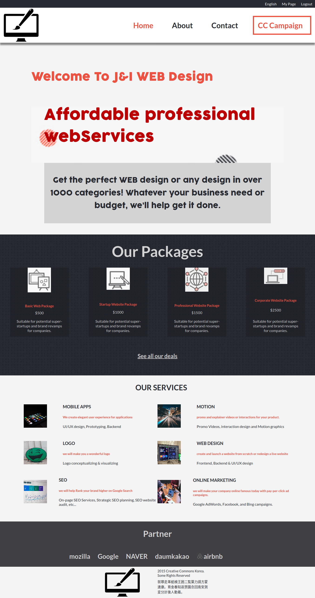
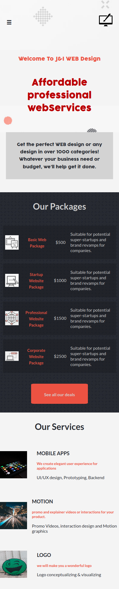

# client-s_website
HTML &amp; CSS capstone project

This is a Capstone project in the end of Microverse's HTML and CSS module. It consists of creating a website based on the following design by: [Cindy Shin in Behance](https://www.behance.net/gallery/29845175/CC-Global-Summit-2015), the requirements was that I build at least 3 pages similar to the pages of this website [Click here to see](https://www.behance.net/gallery/29845175/CC-Global-Summit-2015), the 3 pages required were the Main page, the About page and Tickets page using the same layout, but I could change the contents and the idea if I wanted to do so. Based on their requirements I've decided to build a website of a company that offers web services online, and I've decided to change the ticket page and instead I created a contact page. I've used pure HTML5 and CSS3 techniques to build this website, and I've also made use of the new technologies of CSS3 like Flexbox, Grid, Linear gradients, etc.

#### Additional description about the project and it's features.

## Built With

- HTML 5
- CSS 3
- SASS

##### Screenshots

### Desktop version

### Mobile version

## Live Demo

[Live Demo Link]()

## Getting Started

### Setup
Checkout the project on your web browser with the provided demo link.

### Install
No installation required.

### Deployment
Deployed on Github pages for demonstration purposes.

## Authors

👤 **Iyunda Ismael Antonio**

- GitHub: [@ixboy](https://github.com/ixboy)
- Twitter: [@ismaelixboy](https://twitter.com/ismaelixboy)
- LinkedIn: [Ismael-antonio](https://www.linkedin.com/in/ismael-antonio-0b7712114/)

## 🤝 Contributing

Contributions, issues, and feature requests are welcome!

## Show your support

Give a ⭐️ if you like this project!

## Acknowledgments

-  

- Design idea by [Cindy Shin in Behance](https://www.behance.net/gallery/29845175/CC-Global-Summit-2015)

## 📝 License

This project is [MIT](./LICENSE) licensed.

